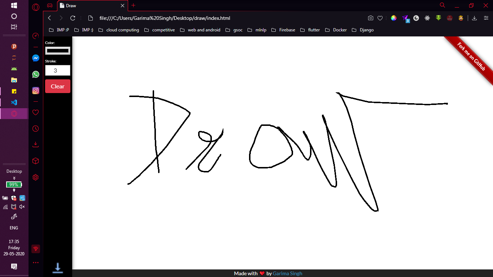

# Draw


## Features 
✔️ Multi Color Pallete
✔️ Brush size control
✔️ Clear all
✔️ Download drawing

## Public Gitter channel 🛠️
Join here: https://gitter.im/KWoC2020/Draw

## Run 🚀

``` 
Run index.html file on your browser.
```


## Technologies used 🛠️

- HTML 5 
- CSS, Javascript and Bootstrap
- [p5.js](https://p5js.org)

**Thanks to [Florin Pop](https://www.florin-pop.com) for his creative project ideas.**

-----

## Snapshots




To view a live example, **[click here](https://quirky-gates-1089b2.netlify.app/)**


## Deployed


-----

## Contributions and PRs

 - PRs should be generated against `master`


### Contributors

- [alpha74](https://www.github.com/alpha74)
